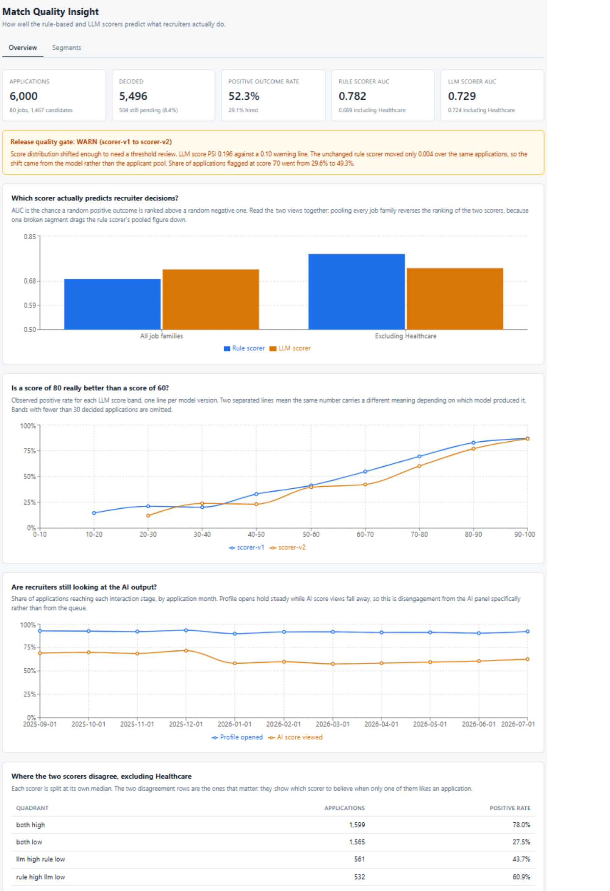
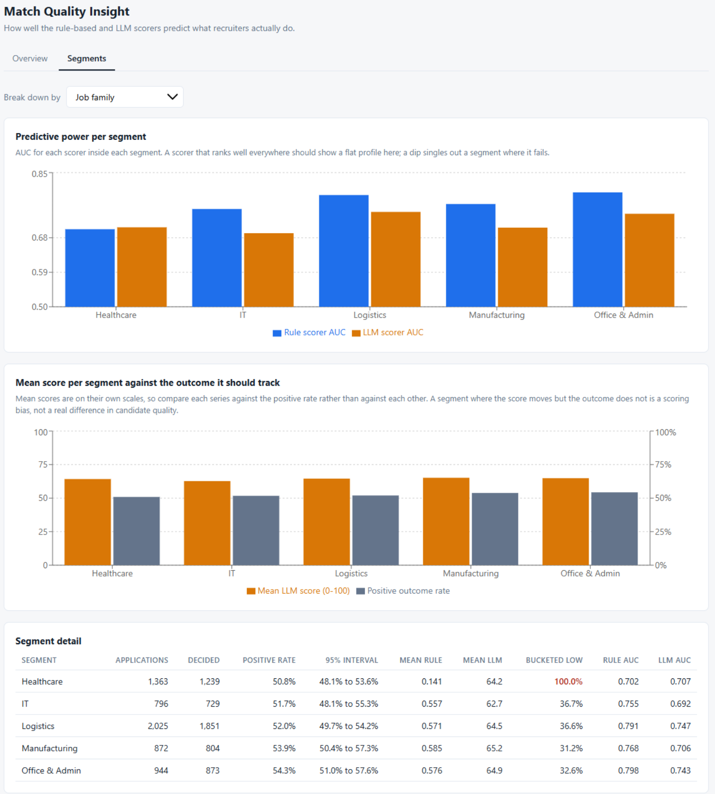

# Match Quality Insight

An AI quality dashboard for the two scoring systems behind candidate matching: a
deterministic rule-based matcher and an advisory LLM reviewer. It loads the source data into
PostgreSQL, computes quality metrics through a REST API, and presents them in a React
dashboard.


```bash
git clone https://github.com/asadaslam556/match-quality-insight.git
cd match-quality-insight
docker compose up --build
```

Then open <http://localhost:5173>. Nothing else needs installing, and nothing needs
configuring. The stack brings its own PostgreSQL, loads the four CSVs on start, and serves
the dashboard.

> **On Windows?** [COMMANDS.md](COMMANDS.md) has every step written out in full for
> PowerShell, including PostgreSQL installation, verification and cache clearing.

---

## The headline

Measured across all job families, the LLM scorer looks better than the rule scorer
(AUC 0.724 against 0.689). **That ranking is an artefact of a bug in one job family.**
Excluding Healthcare, the rule scorer wins at 0.782 against 0.729, and it wins in four of
the five families.

A decision to lean harder on the LLM, taken on the pooled number, would have been based on
a defect rather than on evidence. That reversal is Finding 1.

| | Finding | Evidence |
|---|---|---|
| 1 | The rule scorer is broken for Healthcare, and it inverts the platform-level verdict | All 1,363 Healthcare applications bucketed `low`, max score 0.305 against a 0.5 cut-off, while converting at the platform average |
| 2 | The LLM scores candidates highest when it knows least about them | Mean 74.0 below 0.4 profile completeness against 61.7 above it, and those candidates convert worse, 48.0% against 53.3% |
| 3 | scorer-v2 inflated every score and bought no accuracy | Mean +7.8, AUC 0.731 to 0.727, flag rate at threshold 70 up from 29.6% to 49.3% at 5.9pp lower precision |
| 4 | The LLM gives Austrian candidates an unjustified bonus | AT 69.0 against DE 62.6, surviving every control, on outcome rates of 53.6% and 51.9% |
| 5 | Recruiter trust in the AI panel fell, and the obvious explanation is wrong | AI score views down about 10 points while profile opens held flat, but the break is Dec/Jan and v2 shipped in March |

**Full write-up with per-finding improvement proposals: [ANALYSIS.md](ANALYSIS.md).**

---

## The dashboard

**Overview**: headline metrics, the release quality gate, and the three charts that each
carry a finding.



**Segments**: the drill-down, switchable across job family, profile completeness, country,
model version and seniority. Healthcare's 100% `low` bucketing is flagged in red.



---

## Running it

### The short way

You need [Docker Desktop](https://www.docker.com/products/docker-desktop/). Nothing else.

```bash
git clone https://github.com/asadaslam556/match-quality-insight.git
cd match-quality-insight
docker compose up --build
```

First run takes a few minutes while images are built. When it settles, open:

- Dashboard: <http://localhost:5173>
- API docs (interactive, every endpoint runnable from the browser): <http://localhost:8000/docs>

The backend waits for PostgreSQL to accept connections, loads the four CSVs, and then
starts serving. You should see `applications 6000 rows` in the logs before the API comes
up.

To stop everything: `Ctrl+C`, then `docker compose down`.

### Starting completely fresh

Docker keeps the database inside the container, so removing the containers removes the
data. If a run went wrong and you want a guaranteed clean slate:

```bash
docker compose down -v          # stop and delete containers and volumes
docker compose build --no-cache # rebuild images, ignoring every cached layer
docker compose up
```

If the frontend behaves oddly after a change, its dependency cache is the usual cause:

```bash
docker compose run --rm frontend rm -rf node_modules/.vite
docker compose up --build frontend
```

And in your browser, a hard reload (`Ctrl+Shift+R`, or `Cmd+Shift+R` on macOS) clears the
cached JavaScript bundle.

---

## Running it without Docker

Only needed if you want to run the tests or step through the code. You will need
[PostgreSQL 14 or newer](https://www.postgresql.org/download/), Python 3.12+, and Node 20+.

**1. Create the database.** After installing PostgreSQL, open a terminal and run:

```bash
psql -U postgres -c "CREATE USER mqi WITH PASSWORD 'mqi';"
psql -U postgres -c "CREATE DATABASE mqi OWNER mqi;"
```

On Windows, use the "SQL Shell (psql)" application that ships with PostgreSQL and enter the
two commands after the `postgres=#` prompt. If `psql` is not found on macOS or Linux, it is
usually at `/usr/local/bin/psql` or installed via `brew install postgresql@16`.

Check it worked:

```bash
psql -U mqi -d mqi -c "SELECT version();"
```

**2. Set up the backend.**

```bash
cd backend
python -m venv .venv
source .venv/bin/activate        # Windows: .venv\Scripts\activate
pip install -e ".[dev]"
```

**3. Point it at your database.** Copy the example environment file and edit if your
PostgreSQL uses a different port or password. It belongs in the repo root, and the backend
resolves it from there regardless of which directory you start it from:

```bash
cd ..
cp .env.example .env
```

**4. Load the data.** This drops every table and rebuilds from the CSVs, so it is safe to
re-run whenever you want a clean database:

```bash
cd backend
python -m scripts.load_data
```

Expected output:

```
candidates          1500 rows
jobs                  80 rows
applications        6000 rows
recruiter_events   11758 rows
Load complete.
```

**5. Start the API.**

```bash
uvicorn app.main:app --reload
```

Confirm it is alive at <http://localhost:8000/api/health>.

**6. Start the frontend** in a second terminal:

```bash
cd frontend
npm install
npm run dev
```

Open <http://localhost:5173>.

**If something goes wrong.** `connection refused` means PostgreSQL is not running, so start
the service and retry. `password authentication failed` means `DATABASE_URL` in `.env` does
not match the user you created in step 1. Stale Python bytecode after switching branches
clears with `find . -name __pycache__ -type d -exec rm -rf {} +`, and a confused test cache
clears with `rm -rf .pytest_cache`.

---

## Tests

```bash
cd backend
pytest
```

45 tests covering the metric logic. They need no database, so they run in about a second.

The interesting ones are in `tests/test_compute.py`. AUC is written by hand rather than
taken from scikit-learn, so the tests pin down the behaviour that a hand-written rank
implementation usually gets wrong: tied scores splitting credit correctly, segments with
only one outcome class returning `None` instead of a misleading number, and agreement with
scikit-learn across randomised inputs with heavy ties. `tests/test_service.py` covers the
composition layer: which scorer wins a disagreement, how small segments are flagged, where
the quality gate draws its lines, and that the segment dimension whitelist rejects anything
it does not recognise.

---

## Architecture

```
data/                       the four source CSVs
backend/
  sql/schema.sql            tables, constraints, indexes, and the domain view
  scripts/load_data.py      CSV to PostgreSQL via COPY, drops and rebuilds
  app/
    metrics/sql/*.sql       one file per metric query
    metrics/queries.py      loads and runs those files
    metrics/compute.py      AUC, Wilson intervals, precision@k, PSI
    metrics/service.py      composes query rows and statistics into metrics
    api/routes.py           HTTP layer
    schemas.py              response shapes
frontend/src/
  api.ts                    typed fetch wrapper
  pages/Overview.tsx        headline metrics, calibration, engagement
  pages/Segments.tsx        per-segment drill-down
```

Four layers, each depending only on the one below: **data** (SQL files and the schema),
**domain** (`compute.py` and `service.py`), **API** (`routes.py` and `schemas.py`), **UI**.
Routes do no arithmetic and the service does no SQL, which is what lets the statistics be
tested without a database and the SQL be inspected without reading Python.

**Some decisions worth explaining.**

*The `scored_applications` view is the seam.* Every metric query reads from it rather than
re-joining the base tables. Two definitions live there and only there: what counts as a
positive outcome, and how profile completeness is banded. Changing either is a one-line
change rather than a search across ten files.

*Aggregation is in SQL, ranking statistics are in Python.* Counts, rates, distributions,
crosstabs, funnels and time series are all SQL, because that is where they belong and
because the database does them faster than pulling rows into pandas. AUC, precision@k and
PSI need the full ranked array in memory, so they are Python. The split is deliberate
rather than incidental.

*There are no ORM models.* The API is read-only and every endpoint is an aggregation over a
view. SQLAlchemy is used for connection pooling and parameter binding, and the queries are
plain `.sql` files. Mapping four tables to classes that nothing would ever instantiate
would have been code with no reader.

*AUC is hand-written.* Fewer than twenty lines using the Mann-Whitney identity, which keeps
scikit-learn out of the runtime dependencies and makes the tie handling visible and
testable. The test suite cross-checks it against scikit-learn, which stays a test-only
dependency.

*Two SQL files carry a `{dimension}` placeholder.* Only the grouping column varies between
segment breakdowns. The placeholder is filled from a whitelist in `queries.py` and never
from raw request input, and there is a test asserting the rejection path.

### API

| Endpoint | What it answers |
|---|---|
| `GET /api/overview` | Headline counts, the pooled against ex-Healthcare comparison, quality gate status |
| `GET /api/effectiveness` | AUC, precision and recall at threshold, precision@k, distributions per decision |
| `GET /api/agreement` | Quadrant breakdown and which scorer to believe on disagreement |
| `GET /api/segments?dimension=` | Per-segment metrics with confidence intervals. Dimensions: `job_family`, `country`, `seniority`, `model_version`, `profile_band` |
| `GET /api/calibration?scorer=` | Observed positive rate per score band, split by model version |
| `GET /api/recruiter-behaviour` | Monthly interaction rates and the funnel |
| `GET /api/quality-gate` | PSI drift check between the two most recent model versions |

`effectiveness`, `agreement` and `calibration` accept `exclude_family=Healthcare`, which is
what surfaces Finding 1.

---

## Assumptions

Recorded here rather than raised as questions, per the brief.

- **Positive outcome** means `interviewed` or `hired`. Both represent the recruiter acting
  on the application, which is what the scorers are meant to predict.
- **Pending applications are excluded** from all outcome metrics rather than counted as
  rejections. They are 8.4% of the data and evenly spread across every segment, so this is
  treated as missing-at-random. The evidence for that is in ANALYSIS.md.
- **`shortlisted` is never used as a predictor.** Every shortlisted application ends
  positive, so the event records the decision rather than anticipating it. It appears only
  in the funnel description.
- **Country means the job's country.** The job posting defines the market. 94.3% of
  applications are same-country anyway.
- **Duplicate candidate and job pairs are kept** as distinct applications, since each has
  its own scores, timestamps and decision. There are 243 of them.
- **Profile completeness is banded at 0.4 and 0.7.** The lower edge is where mean LLM score
  drops from 74.0 to 61.7, so the band is drawn from the data rather than chosen for
  roundness.
- **`llm_model_version` is treated as a clean cutover.** v1 runs to February 2026 and v2
  from March 2026, with no overlap, so version and time period are collinear and cannot be
  separated in this dataset.
- **The quality gate compares the two most recent versions** by name order, which matches
  the release order here.

---

## Scope

Built: the full data layer, all seven metric endpoints, the metric test suite, both
dashboard pages, and two of the three optional stretch goals (the calibration analysis,
because it is the evidence for two findings rather than a bonus, and the automated release
quality gate, which is the natural remediation for Finding 3).

Deliberately not built, either because the brief excludes it or because it did not earn its
place in three days:

- **The LLM-assisted classification of disagreement cases**, the third stretch goal. It
  needed a mock client and a harness around it for the least analytical return of the three,
  so it was the first thing cut.
- **Authentication, deployment and mobile support**, all explicitly out of scope.
- **Caching.** Every endpoint recomputes on request. At 6,000 rows the slowest is
  comfortably fast, and adding a cache layer would have been infrastructure serving no
  present need.
- **Visual polish.** The dashboard is deliberately plain. Charts were chosen so that each
  one carries a specific finding, per the brief's preference for a well-chosen chart over
  ten mediocre ones.

## With more time

- **Per-job calibration.** Every metric here pools across jobs, but the product ranks
  candidates *within* a job. A scorer can rank well globally and badly inside individual
  postings, and that is the version of the question that matters to a recruiter.
- **Separate the two positive outcomes.** `interviewed` and `hired` are collapsed together.
  Modelling the second stage separately would show whether the scorers predict recruiter
  interest, actual fit, or only the former.
- **Confidence intervals on AUC**, by bootstrap. Segment positive rates carry Wilson
  intervals but the AUC figures are point estimates, so the smaller per-family differences
  are currently not quantified for significance.
- **A holdout where scores are hidden from recruiters.** The single change that would most
  improve measurement quality, since it is the only way to break the circularity described
  in the ANALYSIS.md method section.
- **Backfill the quality gate across historical releases** to establish what a normal PSI
  looks like for this platform, rather than relying on the generic 0.10 and 0.25 thresholds.